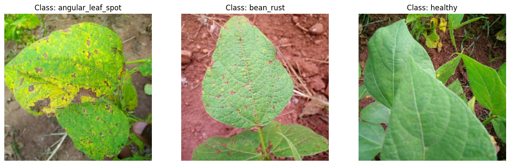
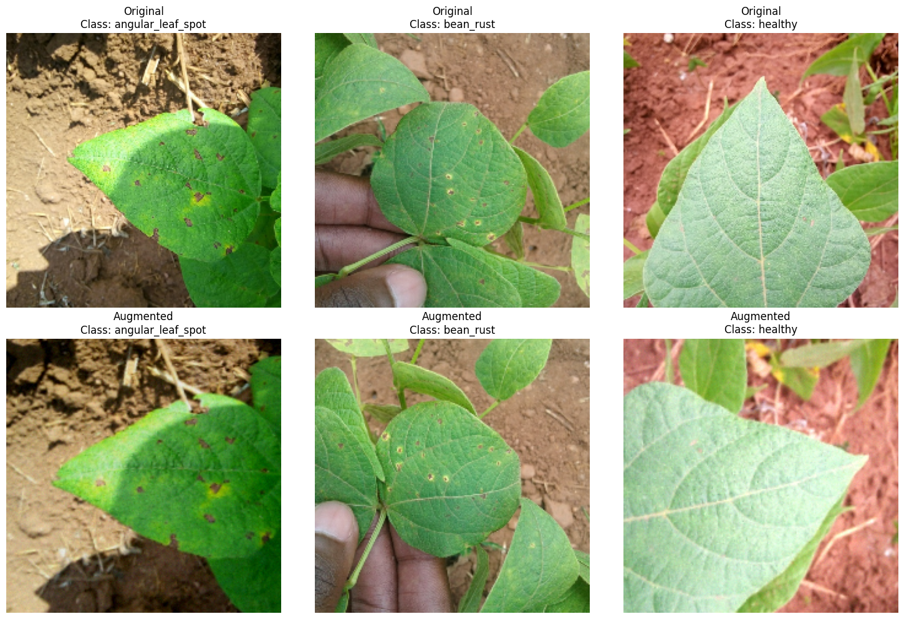
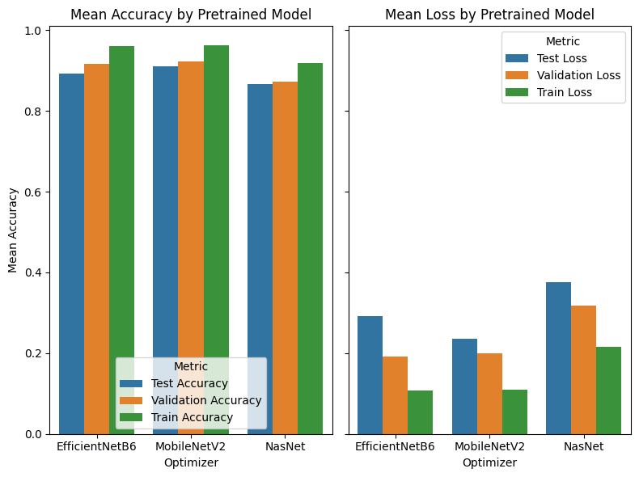

# Beans-Leaf-Diseases-Classification

## Introduction

This is an implementation of [Classification of Beans Leaf Diseases using Fine Tuned CNN Model](https://www.sciencedirect.com/science/article/pii/S1877050923000170) paper using `Tensorflow` library. The goal is to determine if the leaf in the image has angular leaf spot or bean rust or it's healthy. We used transfer learning and only trained the MLP classification head of the models.


## Dataset

We used [this dataset](https://www.kaggle.com/datasets/therealoise/bean-disease-dataset) from Kaggle. You can see three sample images of each class below:



## Data Augmentation

We enhanced the dataset using **Data Augmentation** techniques to increase training data variety without collecting new samples. This improves model performance on unseen data by applying transformations like rotation, flipping, brightness changes, and noise. We used the `Albumentations` library to double the training data by generating an augmented version of each image. The transformations include:

1. **HorizontalFlip**: Flips images horizontally (left-to-right) to simulate mirrored views.
2. **VerticalFlip**: Flips images vertically (top-to-bottom) for added diversity.
3. **Transpose**: Swaps axes (90° rotation) to create new angles.
4. **Rotate**: Randomly rotates images between 10° and 30° for varied perspectives.
5. **Perspective**: Adjusts perspective slightly to mimic depth and angle changes.
6. **RandomBrightnessContrast**: Alters brightness and contrast randomly to simulate different lighting.
7. **GaussNoise**: Adds Gaussian noise to adapt the model to real-world image noise.

These were applied with `prob_low_augmentations` during training to avoid excessive distortion (high probability slowed training significantly). A variable `prob_high_augmentations` was used only for demo images.




## Pre-trained Models

We tested 3 different Pre-trained models for transfer learning:

1. **MobileNetV2**  
   A lightweight, efficient model for resource-constrained devices. It uses a **Bottleneck block** sequence:  
   - **1×1 Expansion Layer**: Increases feature channels.  
   - **3×3 Depthwise Convolution**: Lightweight feature extraction.  
   - **1×1 Projection Layer**: Reduces channels back.  
   Starts with a 2D Convolution, ends with a 1×1 Convolution and 7×7 Average Pooling. **Residual Connections** improve gradient flow if input/output dimensions match. Ideal for low computation with rich features.

2. **Mobile NASNet**  
   A lighter NASNet variant optimized for limited resources via **Neural Architecture Search**. Features modular blocks:  
   - **Sequence A & B**: Combine Separable and Grouped Convolutions for efficiency.  
   Ends with Fully Connected and SoftMax layers for classification. Uses Depthwise Separable Convolutions and techniques like Concatenation/Addition for faster training with decent accuracy.

3. **EfficientNetB6**  
   An advanced EfficientNet model balancing accuracy and efficiency using **compound scaling** (depth, width, resolution). Key features:  
   - **MBConv Layers**: Reduce computation complexity.  
   - **Swish Activation**: Boosts performance over ReLU.  
   Offers high accuracy for image classification/object detection with moderate resource use, ideal for complex tasks.


## Transfer Learning Model

```python
def create_model(base_model):
    
    base_model.trainable = False

    model = Sequential()

    model.add(base_model)
    model.add(GlobalAveragePooling2D())
    model.add(Dropout(0.3))
    model.add(Dense(128, activation='relu'))
    model.add(Dropout(0.3))
    model.add(Dense(64, activation='relu'))
    model.add(Dropout(0.3))
    
    model.add(Dense(3, activation='softmax'))
    
    return model
```

## Loss functions

We tested each model with 3 different loss functions:

1. **Adam**
2. **Nadam**
3. **RMSProp**

## Results

| Model          | Optimizer | Test Accuracy | Validation Accuracy | Train Accuracy |
|----------------|-----------|---------------|---------------------|----------------|
| EfficientNetB6 | Adam      | 0.906250      | 0.924812            | 0.973633       |
| EfficientNetB6 | Nadam     | 0.906250      | 0.917293            | 0.958984       |
| EfficientNetB6 | RMSprop   | 0.867188      | 0.909774            | 0.948242       |
| MobileNetV2    | Adam      | 0.906250      | 0.909774            | 0.956055       |
| MobileNetV2    | Nadam     | 0.914062      | 0.924812            | 0.973633       |
| MobileNetV2    | RMSprop   | 0.914062      | 0.932331            | 0.956055       |
| NasNet         | Adam      | 0.867188      | 0.864662            | 0.930664       |
| NasNet         | Nadam     | 0.890625      | 0.872180            | 0.923828       |
| NasNet         | RMSprop   | 0.843750      | 0.879699            | 0.900391       |





## Contributors
* [Ali Hamzehpour](https://github.com/AliHamzeh2002)
* [Mina Shirazi](https://github.com/meenashrz)
